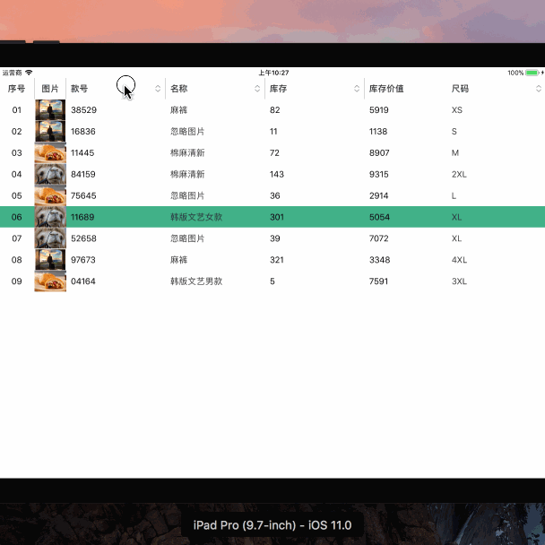
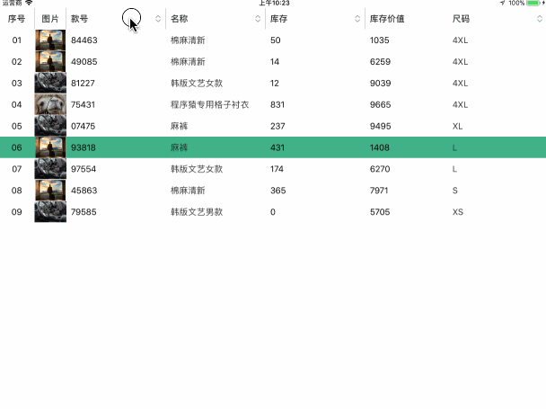

# CCExcelView
iOS ExcelView 自定义表格，支持设置左右向锁住的列数，支持列排序（排序规则自己实现）,支持设置topView，支持列表背景色，支持设置整行还是单元格点击的点击色

[](http://opensource.org/licenses/MIT "Feel free to contribute.")

## 效果展示

### Cell单元格点击效果


### Cell整行点击效果


## 使用说明

* 支持直接copy到项目中使用

* 支持使用 CocoaPods 导入项目中

```ruby
pod 'CCExcelView'
```

然后运行 `pod install` 即可

* 支持使用 Swift Package Manager 导入

Xcode：`File` → `Add Package Dependencies…`，填入：

```text
https://github.com/Jonas-o/CCExcelView.git
```

或在 `Package.swift` 中：

```swift
dependencies: [
    .package(url: "https://github.com/Jonas-o/CCExcelView.git", from: "1.0.10")
]
```

Swift：`import CCExcelView`  
Objective-C：`#import <CCExcelView/CCExcel.h>`

可参考[Demo](https://github.com/Jonas-o/CCExcelViewDemo.git)

## BUG反馈
* QQ、微信：824375137 （支持邮箱，联系时请备注）
